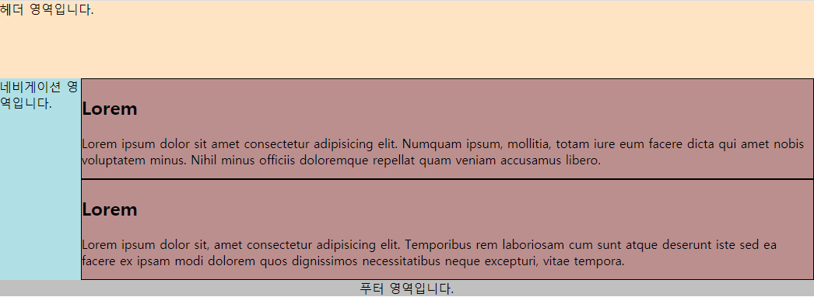

# 1. LAYOUT


## 1.1 컨텐츠 블럭과 보더 블럭

- 컨텐츠 블럭: 블럭의 너비가 **컨텐츠의 크기**와 같음
- 보더 블럭: 블럭의 너비가 **컨텐츠의 크기 + padding의 크기 + boder의 크기**와 같음

css에서는 default로 컨텐츠 블럭이 사용되며 아래와 같이 변경가능하다.

```html
<style>
    .border-box{
        box-sizing: border-box;
    }
    .content-box{
        box-sizing: content-box;
    }
</style>
```


## 1.2 블록과 인라인

- 블록요소: 요소를 사용했을 때 줄바꿈이 일어나는 요소. 즉, 요소의 너비가 가로 전체가 된다. `h1~6`, `p` 그리고 `div`등이 해당한다.
- 인라인요소: 요소가 컨텐츠만큼의 너비를 가지며 줄바꿈이 일어나지 않는 요소. `span`,`a`그리고 `strong`등이 해당한다.


## 1.3 위치(position)

- static: default값으로 top, right, bottom, left 등 위치 속성 적용 안 됨
- absolute: 첫 번째 부모 요소가 없는 경우 브라우저 창 기준 (원점 0,0), 부모가 있는 경우 부모 요소 기준
- relative: 해당 요소의 현재 기본 위치 기준, 위치 변경시 기본 위치를 빈 공간으로 유지
- fixed: 브라우저 창 기준


## 1.4 패딩과 마진

- 패딩: 컨텐츠외에 블럭 내 남는 공간
- 마진: 보더외에 점유하는 공간

컨텐츠 < 패딩 < 보더 < 마진 순으로 감싸져있다.


## 1.5 다단 레이아웃

화면을 세로로 여러 개의 단으로 나눠 콘텐츠를 보여주는 형태. 좌측의 nav를 배치하고 내용을 여러 블록으로 구분해서 구성하고 필요시 `footer`도 추가 할 수 있다. 구성방법으로는 `position: absolute`로 변경해 블록들의 좌표를 정해주는 방법과 `float`를 사용해 위치를 변경하는 방법이 있다.



- `float`을 이용: nav를 `float: left`, 내용을 담고 있는 section을 `float: right`로 설정해 위치를 잡아 준다. 이 때 두 개의 요소가 뜨기 때문에 footer가 의도한 모양으로 나오지 않기 때문에 clearfix라는 클래스를 이용하여 이 문제를 해결한다.

  ```html
  <div class="clearfix">
      <nav>네비게이션 영역</nav>
      <section>
          <article>아티클1</article>
          <article>아티클2</article>
      </section>
  </div>
  -----------------------------
  nav {
  	float: left;
  }
  section {
  	float: right;
  }
  .clearfix::after {
  	content: "";
  	clear: both;
  	display: block;
  }
  ```

- `table`을 이용: div를 큰 테이블로 만들고 다단 레이아웃을 셀로 처리

  ```html
  <div>
      <nav>네비게이션 영역</nav>
      <section>
          <article>아티클1</article>
          <article>아티클2</article>
      </section>
  </div>
  -----------------------------------
  div {
  	display: table;
  }
  nav, section {
  	display: table-cell;
  }
  ```

- `flex`를 이용(https://d2.naver.com/helloworld/8540176)

  ```html
  div {
  	display: flex;
  	justify-content: center;
  	align-items: center;
  }
  ```

- `position: absolute`를 이용: 각각의 블록들을 절대위치로 변경하고 `top`, `bottom`, `left`, `right` 등을 이용해 위치를 지정해주어야 한다. 이 때 위치는 원점을 기준으로 한다.