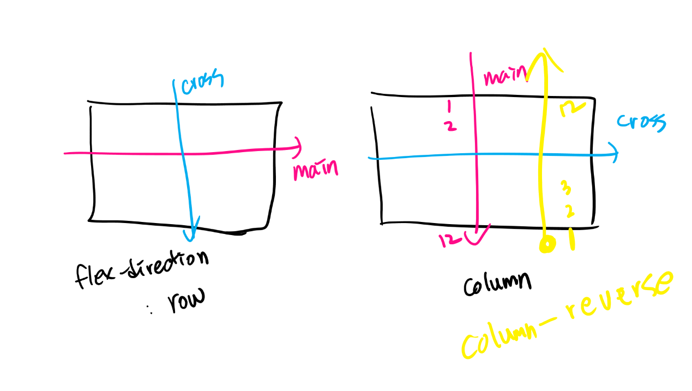

# 1. flex

* `flex` 이전에는 배치를 위해서 `float` , `position` 지정을 해야 했다.
* https://www.w3.org/TR/css-flexbox-1/#box-model


## 1.1 주요 개념



`flex`는 main축과 cross축이 존재하며 default는 main이 row, cross가 column이다. `flex`의 속성들과 두개의 축을 이용하여 원하는 아이템을 적재적소에 위치시킬 수 있다.

`flex`의 바탕이 되는 요소를 `container`, 내부 요소들을 `item`이라고 한다.


## 1.2 속성

`flex`의 속성은 컨테이너 속성과 아이템 단위 속성이 있다.


### 컨테이너 속성

- flex-direction: 아이템들의 주 축을 설정한다. 

  - 값: row, row-reverse, column, column-reverse

- flex-wrap: 줄 바꿈 설정. default는 nowrap

  - 값: nowrap, wrap, wrap-reverse

- justify-content: 주 축의 정렬 방법을 설정한다.

- align-content: 교차 축의 정렬 방법을 설정한다. 아이템이 여러 줄일 때만 사용가능하다.

- align-items: 아이템이 한줄인 경우 교차 축의 정렬 방법을 설정한다.

  - 값: flex-start, flex-end, center, space-between, space-around

- flex-flow: 주 축 설정과 줄 바꿈 설정을 한번에 할 수 있음

  ```css
  flex-flow: {flex-direction값} {flex-wrap값}
  ```


### 아이템 속성

- order: 아이템 별로 숫자를 정할 수 있으며, 숫자가 높을 수록 진행방향 뒤 쪽에 위치하게 된다. default는 0
- align-self: 교차 축에서 아이템 단위 정렬 방법을 설정한다.
- flex-grow:  컨테이너에서 빈 공간을 설정 비율만큼 더 갖는다.
- flex-shrink: 컨테이너에서 벗어난 콘텐츠 크기를 고려해 설정 비율만큼 줄어든다.


## 1.3 참고하면 좋은 사이트

**FLEXBOX FROGGY**: 이해를 돕는 게임. 위의 속성들을 체험해 볼 수 있다. [링크](https://flexboxfroggy.com/#ko)


# 2. bootstrap

웹사이트를 쉽게 만들 수 있게 도와주는 HTML, CSS, JS 프레임워크이다. 다양한 클래스들을 제공하며 반응형, grid, flex등을 지원한다. [부트스트랩 공식 홈페이지](https://getbootstrap.com/)에 접속하여 css와 js관련 CDN을 사용하거나 css, js파일을 다운로드 받아 사용할 수 있다.

상단의 Documentation nav에 들어가면 검색기능을 사용할 수 있는데 원하는 요소를 검색하면 높은 성능의 색인으로 검색이 가능하다. 검색시에 `shift`+`Enter`를 사용하면 더 편리하게 사용 할 수 있다.

부트스트랩에서는 예를 들어 다음과 같이 간단한 레이아웃을 만들 수 있다.

```html
<body>
    <nav class="d-flex flex-column bg-primary">
        <ul>
            <li class="inline">Home</li>
            <li class="inline">info</li>
        </ul>
    </nav>
</body>
```

